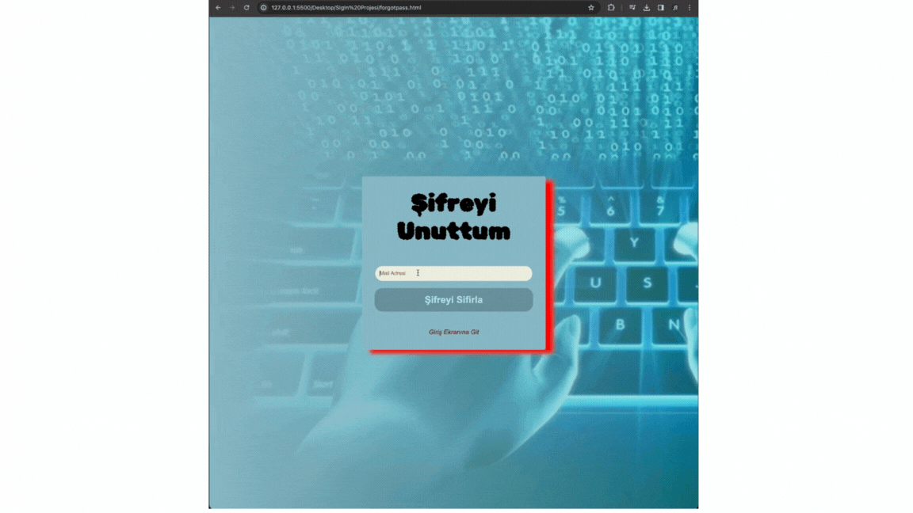

# FxSoldier Giriş Formu
Bu proje, kullanıcıların FxSoldier platformuna giriş yapabilmeleri için bir web formunu içermektedir.
## İçindekiler
Proje Hakkında
Kullanılan Teknolojiler
Kurulum
Kullanım
Ek Bilgiler
Proje Hakkında
Bu proje, kullanıcıların FXSoldier platformuna kolayca giriş yapabilmelerini sağlamak amacıyla tasarlanmıştır. Giriş formu, kullanıcı adı ve şifre alanlarını içermekte ve ayrıca şifreyi unutan kullanıcılar için şifre sıfırlama ve yeni hesap oluşturma bağlantılarına da sahiptir.
## Kullanılan Teknolojiler
HTML
CSS
Kurulum
Proje dosyalarını bilgisayarınıza indirin.
İndirdiğiniz dosyaları bir klasöre çıkarın.
index.html dosyasını bir web tarayıcısıyla açarak projeyi görüntüleyebilirsiniz.
Kullanım
Web tarayıcınızı açın.
Projenin bulunduğu klasördeki index.html dosyasını çift tıklayarak açın.
Giriş formu üzerinden kullanıcı adı ve şifrenizi girin.
"Şifreyi Unuttum" bağlantısıyla şifrenizi sıfırlayabilir veya "Bir Hesabım Yok, Hesap Oluştur" bağlantısıyla yeni bir hesap oluşturabilirsiniz.

### gif

# s-g-n-page
# s-g-n-page
